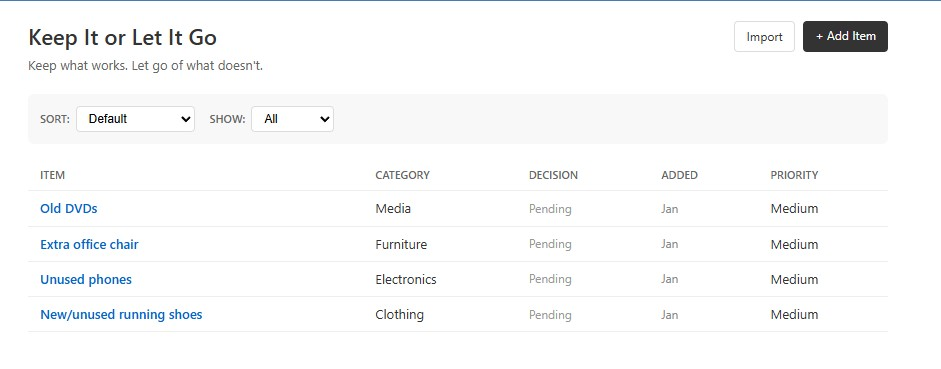

# Decision Tracker  
*Keep It or Let It Go*

A small Java application for tracking simple keep-or-let-go decisions for personal items.

---

## Overview

Keep It or Let It Go is a small Java application for tracking simple keep-or-let-go decisions. Items are added for consideration, reviewed over time, and eventually marked as either kept or removed.

---

## Objective

The objective of this project was to practice core Java concepts while designing a simple, maintainable application with a well-defined lifecycle for user decisions.

---

## Features

- Add items for consideration
- Track items until a decision is made
- Record final decision and decision date
- Remove completed items from the active list

---

## Tech Stack

- Java 11+
- Spring Boot 2.7
- Thymeleaf
- H2 Database (file-based)
- Maven

---

## Running Locally

```text
run.bat
```

Then open: http://localhost:8080

---


## Notes

This project was originally developed as part of a Java programming course and later lightly refactored for personal use. The emphasis is on clarity and practical application of foundational concepts.

---


## Author

K Flowers

